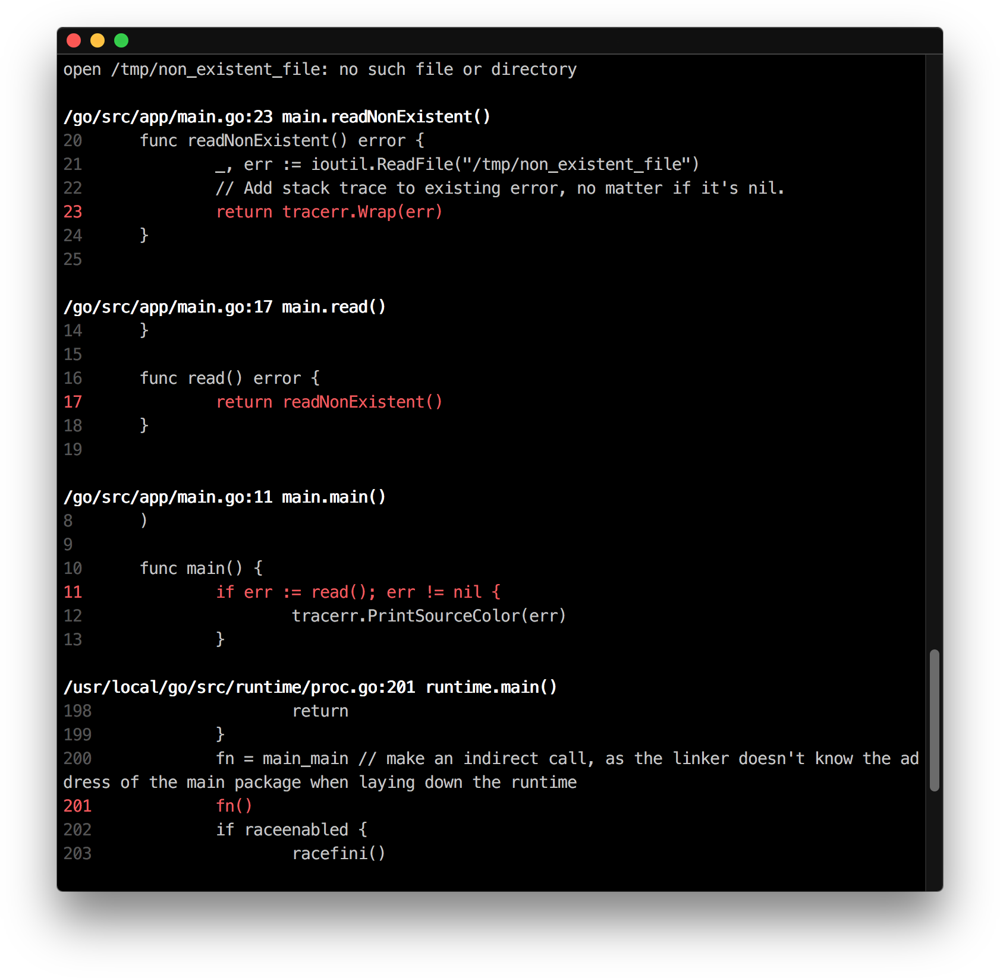

# Golang Errors with Stack Trace and Source Fragments

[](https://godoc.org/github.com/ztrue/tracerr)
[](https://goreportcard.com/report/github.com/ztrue/tracerr)

Tired of uninformative error output? Probably this will be more convenient:



## Sample

```go
package main

import (
	"io/ioutil"

	"github.com/ztrue/tracerr"
)

func main() {
	if err := read(); err != nil {
		tracerr.PrintSourceColor(err)
	}
}

func read() error {
	return readNonExistent()
}

func readNonExistent() error {
	_, err := ioutil.ReadFile("/tmp/non_existent_file")
	// Add stack trace to existing error, no matter if it's nil.
	return tracerr.Wrap(err)
}
```

Find more executable examples in [examples](examples) dir.

## How to Use

### Import

```go
import "github.com/ztrue/tracerr"
```

### Create New Error

```go
err := tracerr.New("some error")
```

Or:

```go
err := tracerr.Errorf("some error %d", num)
```

### Add stack trace to existing error

> If `err` is `nil` then it still be `nil` with no stack trace added.

```go
err = tracerr.Wrap(err)
```

### Print Error and Stack Trace

> Stack trace will be printed only if `err` is of type `*tracerr.Error`, otherwise just error text will be shown.

This will print error message and stack trace if any:

```go
tracerr.Print(err)
```

This will add source code:

```go
tracerr.PrintSource(err)
```

It's able to set up number of lines of code to display for each frame, which is `6` by default:

```go
tracerr.PrintSource(err, 9)
```

Or to set up number of lines before and after traced line:

```go
tracerr.PrintSource(err, 5, 2)
```

The same, but with color, which is much more useful:

```go
tracerr.PrintSourceColor(err)
```

```go
tracerr.PrintSourceColor(err, 9)
```

```go
tracerr.PrintSourceColor(err, 5, 2)
```

### Save Output to Variable

It's also able to save output to variable instead of printing it, which works the same way:

```go
text := tracerr.Sprint(err)
```

```go
text := tracerr.SprintSource(err)
```

```go
text := tracerr.SprintSource(err, 9)
```

```go
text := tracerr.SprintSource(err, 5, 2)
```

### Get Stack Trace

> Stack trace will be empty if `err` is not an instance of `*tracerr.Error`.

```go
frames := tracerr.StackTrace(err)
```

Or if `err` is of type `*tracerr.Error`:

```go
frames := err.StackTrace()
```
